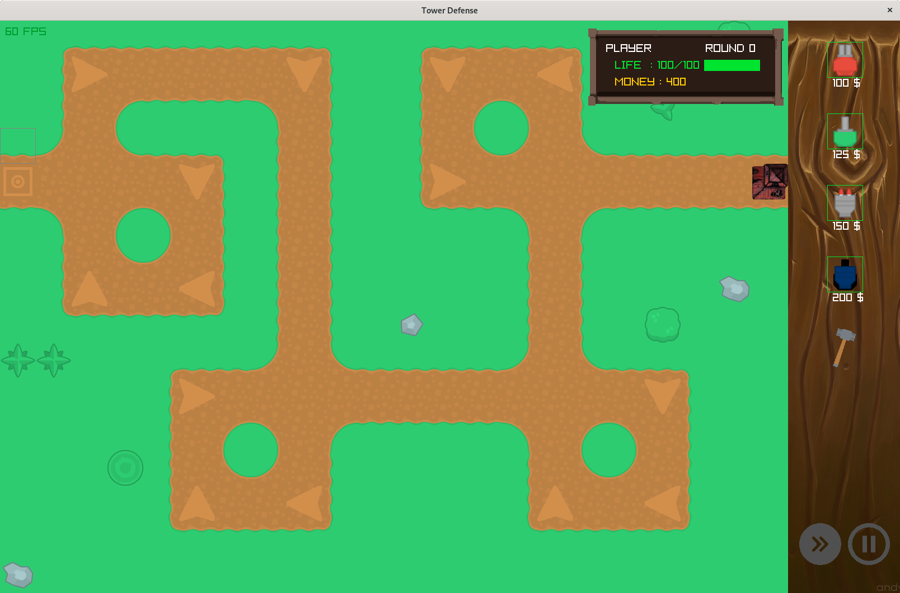
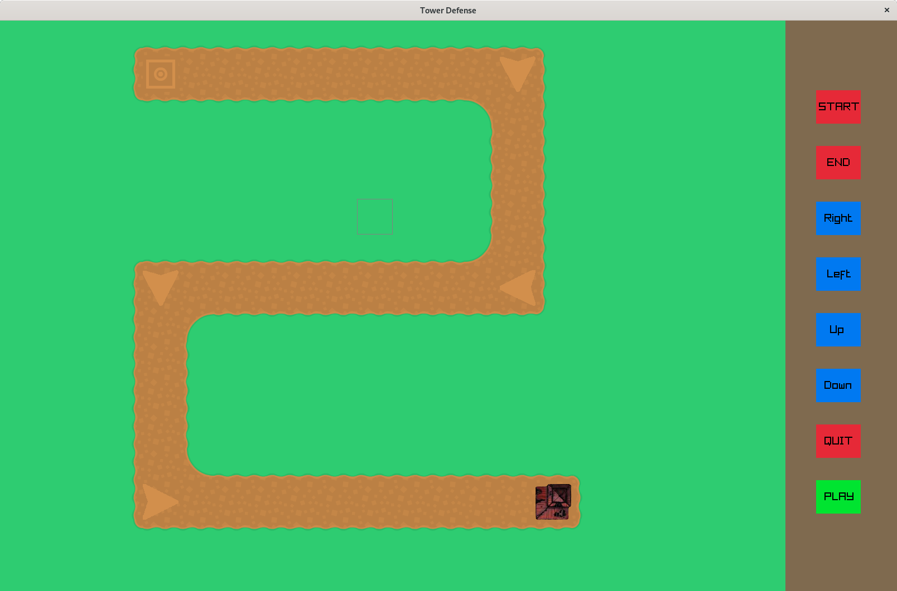
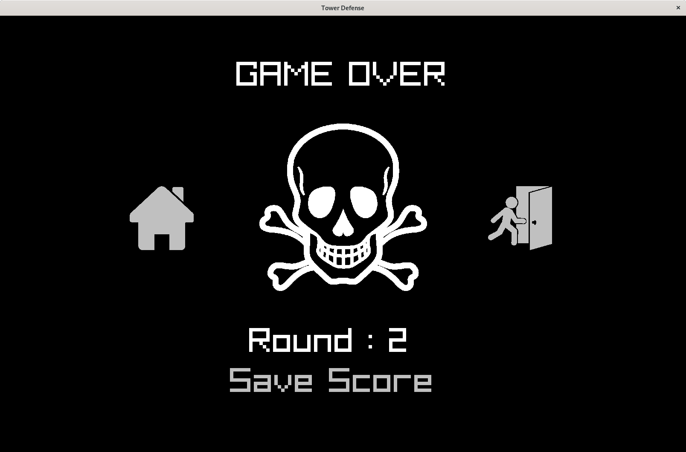

# Project Tower Defense
<hr />

**Authors : Bruno Gomes, Laurent Lin & Omaya Lise**

For ISART Digital

<hr /><br />

## **Project description :**

We created a tower defense game, using raylib, free assets and our math library. The game include all the classic features of a tower defense game such as waves of enemies on predefined path and towers management.

To launch game : 
<br />Enter the command "make && ./tower" in the terminal.

<br /><hr /><br />

## **Game features :**
<ul>
<li>Classic tower defense features (towers placement and upgrade, drag and drop from the shop, increasing difficulty each wave).
<li>Four tower types (classic, slowing, explosive and sniper).
<li>Four enemies types (classic, strong, healer, drifter) with one boss (tank) every ten waves.
<li>Scenery randomly generated each time.
<li>Two map already created plus the possibility to create your own and play it with the map editor.
<li>Possibility to change the music's and sounds 's volume.
</ul><br />



##  **`Map Editor :`**  
`To create a map, the user needs to place a starting point. By default, enemies will go the right of it. To change their direction, the player needs to put down a direction arrow. The enemies will ignore any road not on their current direction although the player won't be able to put towers on these tiles. If the path created does not have a starting and an ending point, an error message will appear. The user can play his map by clicking play or discard it by returning to the main menu.`
</ul><br />



##  **Unresolved bugs:**
<ul>
<li>A white line will sometimes appears behind enemies (at the limit of their sprite) at particular speeds.
<li>We lacked sprites to create visuals for any possible shape of road. Thus some visual bugs can be seen on the road's sides in the map editor.
</ul><br />

##  **Hardest part of the project:**
<ul>
<li>Creating an efficient path finding for the enemies.
</ul><br />

##  **Features to add:**
<ul>
<li>Add a new type of tower and enemy.
<li>Better animations for the enemies and towers.
<li>Multiplayer on local and online.
</ul><br />
<hr /><br />

## **Architecture**
```sh.
├── assets
│   ├── logo.png
│   ├── soundAndMusic
│   │   ├── bossDied.mp3
│   │   ├── classique.mp3
│   │   ├── EndermanTeleportSound.mp3
│   │   ├── foom_0.wav
│   │   ├── GameOver2.mp3
│   │   ├── healer.mp3
│   │   ├── laser.wav
│   │   ├── sniperSound.mp3
│   │   ├── soundExplosion.mp3
│   │   ├── soundGame.mp3
│   │   ├── soundMenu.mp3
│   │   ├── strong.mp3
│   │   └── YOU DIED.mp3
│   └── texture
│       ├── background.png
│       ├── bouttons.png
│       ├── buttonPause.png
│       ├── Enderman_particles.png
│       ├── exit.png
│       ├── Explosion.png
│       ├── gameover.png
│       ├── genericItem_color_023.png
│       ├── License.txt
│       ├── logoHome.png
│       ├── map_one_preview.png
│       ├── map_two_preview.png
│       ├── menu.png
│       ├── montd'or.png
│       ├── Music.png
│       ├── muteMusic.png
│       ├── muteSound.png
│       ├── next.png
│       ├── play.png
│       ├── resume.png
│       ├── Sound.png
│       └── towerDefense_tilesheet.png
├── gameScore.bin
├── include
│   └── math_towerdefense.hpp
├── Makefile
├── README.md
├── src
│   ├── entities
│   │   ├── enemies
│   │   │   ├── enemies.cpp
│   │   │   ├── enemies.d
│   │   │   ├── enemies.hpp
│   │   │   └── enemies.o
│   │   ├── entities.cpp
│   │   ├── entities.d
│   │   ├── entities.hpp
│   │   ├── entities.o
│   │   └── towers
│   │       ├── towers.cpp
│   │       ├── towers.d
│   │       ├── towers.hpp
│   │       └── towers.o
│   ├── game.cpp
│   ├── game.d
│   ├── game.hpp
│   ├── game.o
│   ├── main.cpp
│   ├── main.d
│   ├── main.o
│   ├── map.cpp
│   ├── map.d
│   ├── map.hpp
│   ├── map.o
│   ├── player.cpp
│   ├── player.d
│   ├── player.hpp
│   ├── player.o
│   ├── scene
│   │   ├── scene.cpp
│   │   ├── scene.d
│   │   ├── scene.hpp
│   │   └── scene.o
│   ├── scoreboard.cpp
│   ├── scoreboard.d
│   ├── scoreboard.hpp
│   ├── scoreboard.o
│   ├── setup.hpp
│   ├── soundAndMusic.cpp
│   ├── soundAndMusic.d
│   ├── soundAndMusic.hpp
│   └── soundAndMusic.o
├── third_party
│   ├── include
│   │   └── raylib.h
│   ├── libs-wasm32-unknown-emscripten
│   │   └── libraylib.a
│   ├── libs-x86_64-linux-gnu
│   │   └── libraylib.a
│   └── libs-x86_64-pc-cygwin
│       └── libraylib.a
└── tower
``` 

Code editor : Visual Studio Code
<br />
System : Linux

